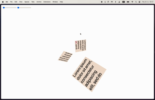

# TWGL Raycaster

This is a simple low-level raycaster written in Vanilla JavaScript using the [TWGL library](https://github.com/greggman/twgl.js) for WebGL.

You may try it out [here](https://neon-froyo-5894a1.netlify.app/).

I would be glad if it helps you in any way. 
If you have any questions or suggestions - feel free to contact me 😉

Have a Great Day!
